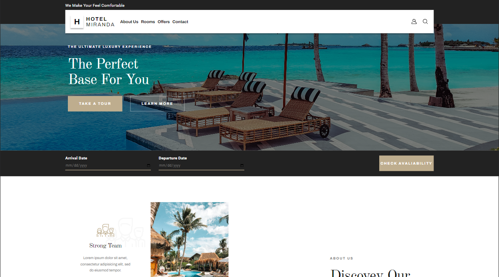

<h1 align="center">Hotel Miranda</h1>

<div align="center">
   Sprint 1 Oxygen Training
</div>

<div align="center">
  <h3>
    <a href="rickhalmoguera.github.io/HotelMiranda/">
      Demo
    </a>
     <span> | </span>
    <a href="https://rickhalmoguera.github.io/PORTFOLIO/">
      Portfolio
    </a>
  </h3>
</div>

<!-- TABLE OF CONTENTS -->

## Table of Contents

- [Overview](#overview)
  - [Built With](#built-with)
- [Features](#features)
- [Contact](#contact)
- [Acknowledgements](#acknowledgements)

## Overview
Welcome to the Hotel Miranda's online platform! This website, developed using HTML, Sass, and following the BEM (Block Element Modifier) methodology, offers users a seamless experience to explore, book rooms, and request information about our hotel.
# Desktop Screenshot


# Mobile Screenshot


### Built With

- [HTML](https://developer.mozilla.org/es/docs/Web/HTML)
- [Css](https://developer.mozilla.org/es/docs/Web/CSS)
- [FlexBox](https://css-tricks.com/snippets/css/a-guide-to-flexbox/)
- [JavaScript](https://developer.mozilla.org/es/docs/Web/JavaScript)
- [BEM](https://getbem.com/)
- [SwiperJs](https://swiperjs.com/)

## Features

This site was created as a submission to the Training in [Oxygen Academy](https://oxygenacademy.es/). Where we practice the following points:

- Responsive Layout.
- Usage of BEM.
- Usage of SwiperJs.

We can observe these practices in the following features:

- A responsive navigation bar that adjusts seamlessly between Mobile and Desktop views.
- Dynamic sliders showcasing rooms, menus, and facilities.
- Smooth navigation between various pages.
- Inclusion of a contact form for easy communication.

## How To Use

To clone and run this application, you'll need [Git](https://git-scm.com) and [Node.js](https://nodejs.org/en/download/) (which comes with [npm](http://npmjs.com)) installed on your computer. From your command line:

```bash
# Clone this repository
$ git clone https://github.com/RickHalmoguera/Oxygen-Shop
# install dependencies
$ npm install
# run project
$npm run dev
```


## Acknowledgements

- [Vite](https://vitejs.dev/)
- [Sass](https://sass-lang.com/guide/)
- [SwiperJs](https://swiperjs.com/)


## Contact

- Website [PORTFOLIO](https://rickhalmoguera.github.io/PORTFOLIO/)
- GitHub [@RickHalmoguera](https://github.com/RickHalmoguera)
